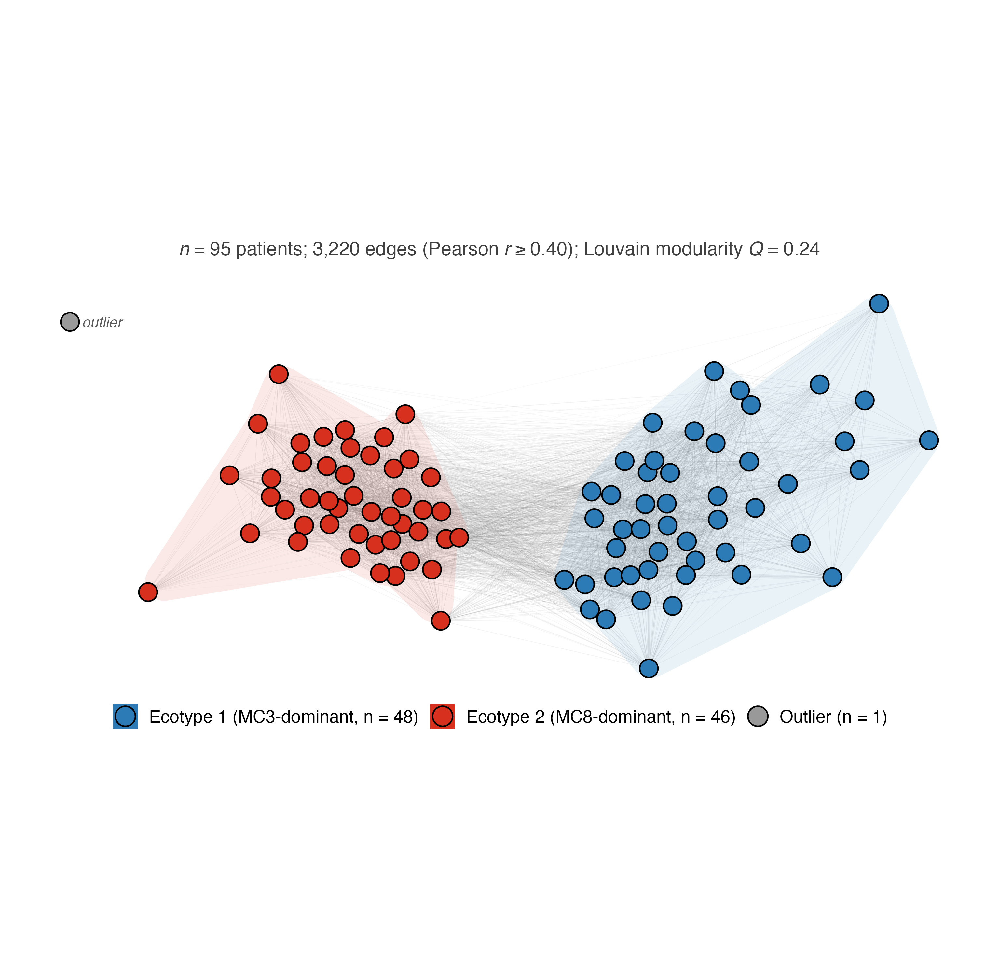
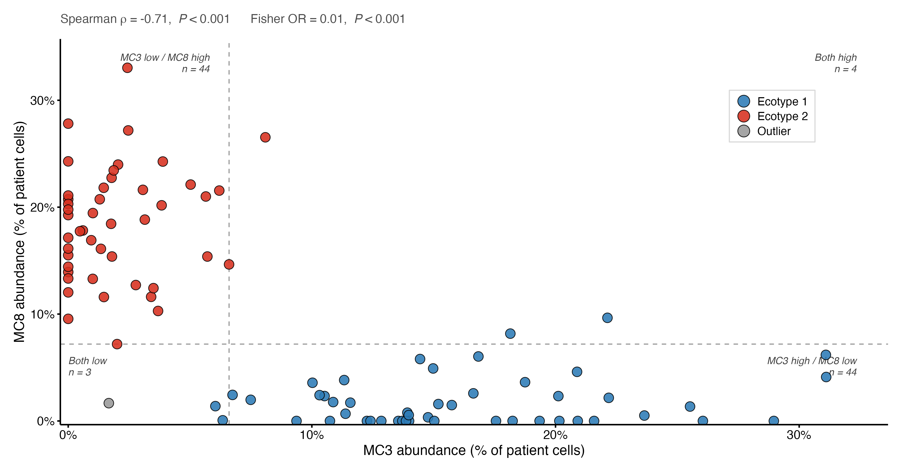

# pdac-ecotype-figures

Publication-style figure scripts from a single-cell study of metabolic
heterogeneity in pancreatic ductal adenocarcinoma (PDAC). Given a patient-level
metabolic-cluster composition table, the scripts produce two figures:

- a **patient-similarity network** coloured by metabolic *ecotype*, and
- an **MC3-vs-MC8 scatter** quantifying the antagonism between the two
  dominant metabolic clusters.

The repository ships a small **synthetic** dataset and the generator that builds
it, so everything can be cloned and run end to end without any patient data
(see [Data](#data)).

## Figures

### Patient-similarity network



Each node is a patient; edges link patients whose 12-dimensional
metabolic-cluster composition vectors correlate at Pearson *r* ≥ 0.40. Louvain
community detection recovers two ecotypes — MC3-dominant and MC8-dominant —
together with a single outlier. Layout uses a backbone algorithm suited to dense
networks, and the outlier is positioned manually beside the main cluster.

### MC3 vs MC8 abundance



Patient-level abundances of the two dominant metabolic clusters, showing their
mutual exclusivity. Statistics are a Spearman correlation and a Fisher test on
the median-split quadrants.

## Background

These figures come from a larger analysis in which single cells from several
public PDAC datasets were scored for metabolic pathway activity, grouped into 12
metabolic clusters (MCs), and aggregated to patient level. Patients separate
along a continuous MC3 ↔ MC8 axis into two metabolic *ecotypes*. The full
methodology is described in the associated thesis and a manuscript in
preparation; this repository isolates the two patient-level figure scripts as a
self-contained, reproducible example of the plotting and network code.

## Repository layout

```
pdac-ecotype-figures/
├── R/
│   ├── fig_patient_network.R     # patient-similarity network figure
│   └── fig_mc3_mc8_scatter.R     # MC3-vs-MC8 scatter figure
├── data/
│   ├── generate_example_data.R   # builds the synthetic dataset
│   └── example_input.rds         # synthetic patient × MC data (committed)
├── output/                       # figures are written here
├── LICENSE
└── README.md
```

## Running it

Run everything **from the repository root** so the relative paths resolve (in
RStudio, open the folder as a Project or `setwd()` to the repo root).

1. *(Optional)* Rebuild the synthetic data — `example_input.rds` is already
   committed, so you can skip straight to step 2:

   ```r
   Rscript data/generate_example_data.R
   ```

2. Build the figures:

   ```r
   Rscript R/fig_patient_network.R
   Rscript R/fig_mc3_mc8_scatter.R
   ```

   Each writes a 600-dpi PDF and PNG to `output/`.

### Dependencies

R (≥ 4.0) and:

```r
install.packages(c("igraph", "ggraph", "graphlayouts", "ggforce",
                   "concaveman", "ggplot2", "dplyr", "tidyr", "tibble"))
```

- **Network figure:** `igraph`, `ggraph`, `graphlayouts`, `ggforce`,
  `concaveman`, `ggplot2`, `dplyr`
- **Scatter figure:** `ggplot2`, `dplyr`, `tidyr`
- **Generator:** `igraph`

## Data

The committed dataset is **entirely synthetic**. `generate_example_data.R`
simulates 95 patients across 12 metabolic clusters — two ecotypes plus an
outlier — with a correlation structure that reproduces the *shape* of the real
analysis (the connected two-community network and the MC3/MC8 antagonism) while
containing no real or patient-derived data of any kind. The generator is
parameterised and seeded, so the example is fully reproducible.

## License

Released under the MIT License — see [LICENSE](LICENSE).

---

*Author: Mohammed Ahmed · mohammed.ahmed@oncology.ox.ac.uk*
